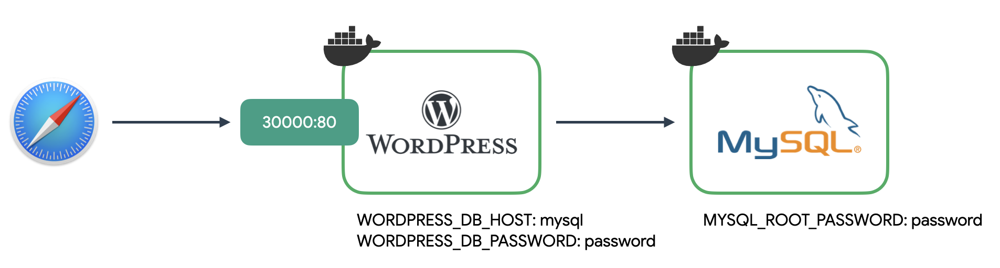
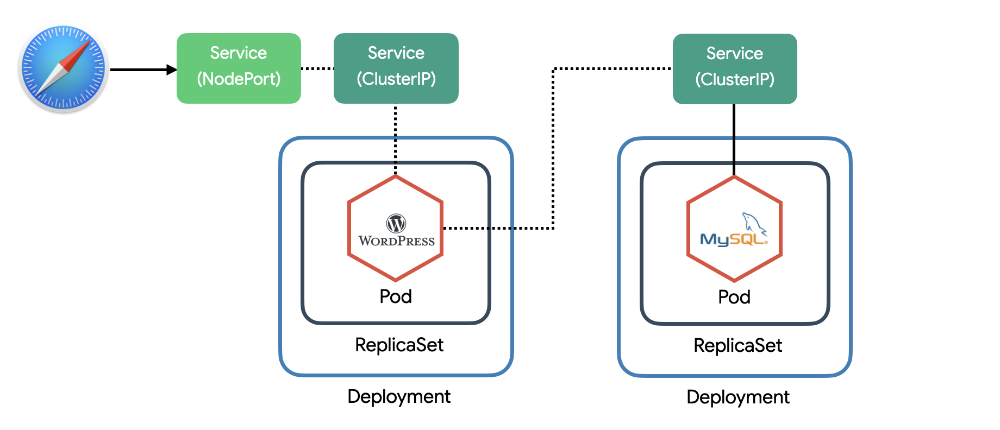

## minikube

- minikube는 쿠버네티스의 모든 기능을 테스트할 순 없지만 쿠버네티스의 기본적인 기능을 익히고 친해지는데 가장 좋은 도구입니다. 대부분의 환경에서 사용할 수 있고 간편하며, 무료(!)입니다.
- 실습하는 동안 minikube를 켜고 실습이 완료되면 종료합니다. 내 CPU, 메모리는 소중하니까요.

```bash
# minikube 상태확인
minikube status

# minikube 실행
minikube start

# 특정 k8s 버전 실행
minikube start --kubernetes-version=v1.20.0

# 특정 driver 실행
minikube start --driver=virtualbox --kubernetes-version=v1.20.0

# minikube ip 확인 (접속테스트시 필요)
minikube ip

# minikube 종료
minikube stop

# minikube 제거
minikube delete
```

## 워드프레스 배포

- 도커 컴포즈 이용한 배포
  

```yml
# guide/index/docker-compose.yml
version: "3"

services:
  wordpress:
    image: wordpress:5.5.3-apache
    environment:
      WORDPRESS_DB_HOST: mysql
      WORDPRESS_DB_PASSWORD: password
    ports:
      - "30000:80"

  mysql:
    image: mysql:5.6
    environment:
      MYSQL_ROOT_PASSWORD: password
```

- 쿠버 네티스를 이용한 배포
  

> 구분자  
> 하나의 YAML파일에 여러 개의 리소스를 정의할 땐 "---"를 구분자로 사용합니다.

```yml
# guide/index/wordpress-k8s.yml
apiVersion: apps/v1
kind: Deployment
metadata:
  name: wordpress-mysql
  labels:
    app: wordpress
spec:
  selector:
    matchLabels:
      app: wordpress
      tier: mysql
  template:
    metadata:
      labels:
        app: wordpress
        tier: mysql
    spec:
      containers:
        - image: mysql:5.6
          name: mysql
          env:
            - name: MYSQL_ROOT_PASSWORD
              value: password
          ports:
            - containerPort: 3306
              name: mysql

---
apiVersion: v1
kind: Service
metadata:
  name: wordpress-mysql
  labels:
    app: wordpress
spec:
  ports:
    - port: 3306
  selector:
    app: wordpress
    tier: mysql

---
apiVersion: apps/v1
kind: Deployment
metadata:
  name: wordpress
  labels:
    app: wordpress
spec:
  selector:
    matchLabels:
      app: wordpress
      tier: frontend
  template:
    metadata:
      labels:
        app: wordpress
        tier: frontend
    spec:
      containers:
        - image: wordpress:5.5.3-apache
          name: wordpress
          env:
            - name: WORDPRESS_DB_HOST
              value: wordpress-mysql
            - name: WORDPRESS_DB_PASSWORD
              value: password
          ports:
            - containerPort: 80
              name: wordpress

---
apiVersion: v1
kind: Service
metadata:
  name: wordpress
  labels:
    app: wordpress
spec:
  type: NodePort
  ports:
    - port: 80
  selector:
    app: wordpress
    tier: frontend
```

```bash
# wordpress-k8s.yml 설정 적용 (로컬파일로)
kubectl apply -f wordpress-k8s.yml
# 또는 (URL로)
kubectl apply -f https://subicura.com/k8s/code/guide/index/wordpress-k8s.yml

# 현재 상태 확인
kubectl get all

# 워드프레스 리소스를 제거
kubectl delete -f wordpress-k8s.yml
```
