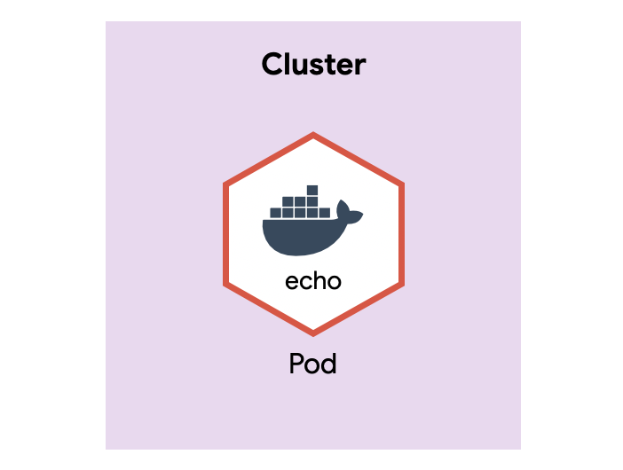
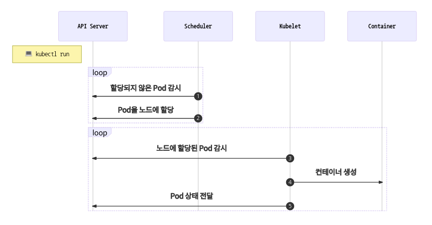
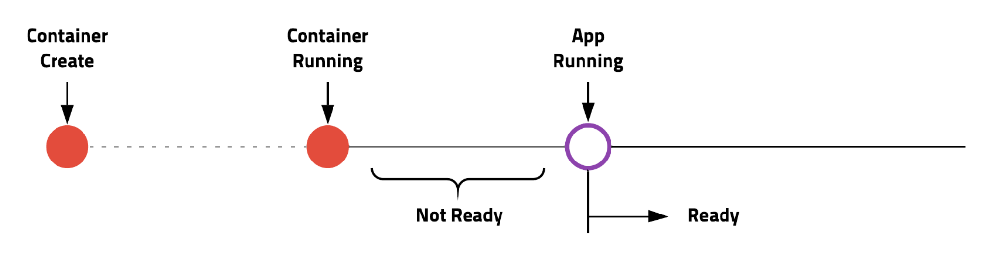
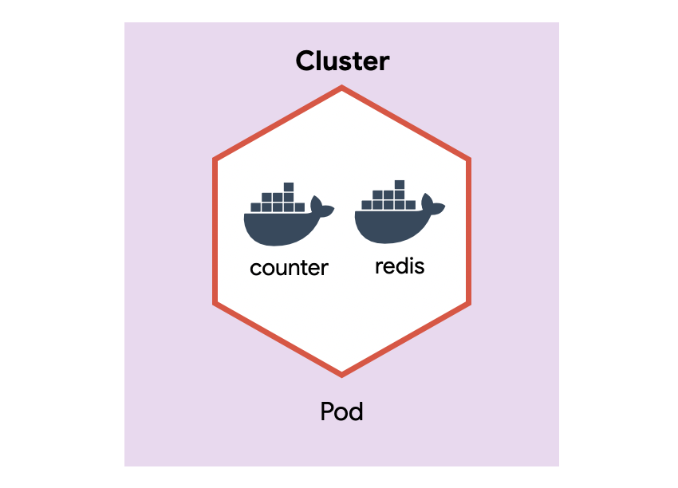

> 리소스 제거  
>  실습이 끝나면 delete 명령어로 리소스를 제거해주세요.

# Pod

- Pod은 쿠버네티스에서 관리하는 가장 작은 배포 단위입니다.
- 쿠버네티스와 도커의 차이점은 도커는 컨테이너를 만들지만, 쿠버네티스는 컨테이너 대신 Pod을 만듭니다. Pod은 한 개 또는 여러 개의 컨테이너를 포함합니다.

## 빠르게 Pod 만들기

```bash
# docker run에 익숙한 분들을 위해 kubectl run 명령어를 소개
kubectl run echo --image ghcr.io/subicura/echo:v1

# Pod 목록 조회
kubectl get pod

# 단일 Pod 상세 확인
kubectl describe pod/echo

# Pod 제거
kubectl delete pod/echo
```

## Pod 생성 분석

- Pod은 다음과 같이 구성되어있습니다. minikube 클러스터 안에 Pod이 있고 Pod 안에 컨테이너가 있습니다.
  
- kubectl run을 실행하고 Pod이 생성되는 과정
  
  1. Scheduler는 API서버를 감시하면서 할당되지 않은unassigned Pod이 있는지 체크
  2. Scheduler는 할당되지 않은 Pod을 감지하고 적절한 노드node에 할당 (minikube는 단일 노드)
  3. 노드에 설치된 kubelet은 자신의 노드에 할당된 Pod이 있는지 체크
  4. kubelet은 Scheduler에 의해 자신에게 할당된 Pod의 정보를 확인하고 컨테이너 생성
  5. kubelet은 자신에게 할당된 Pod의 상태를 API 서버에 전달
     잘 디자인된 모듈이 각자 역할을 충실하게 수행하고 있는 모습입니다. 현재 테스트는 단일 노드지만 노드가 수십, 수백 개가 되어도 Scheduler만 열심히 일하면 문제없는 구조입니다. 갓 구글!

## YAML로 설정파일Spec 작성하기

- 필수 요소
  | 정의 | 설명 | 예 |
  |----------|---------------|-------------------------------------------|
  | version | 오브젝트 버전 | v1, app/v1, networking.k8s.io/v1, ... |
  | kind | 종류 | Pod, ReplicaSet, Deployment, Service, ... |
  | metadata | 메타데이터 | name과 label, annotation(주석)으로 구성 |
  | spec | 상세명세 | 리소스 종류마다 다름 |

version, kind, metadata, spec는 리소스를 정의할 때 반드시 필요한 요소입니다.

> **version**  
> Alpha(v1alpha1, ...) > Beta(v1beta1, ...) > Stable(v1)의 과정을 거치며 쿠버네티스 버전에 따라 지원하는 리소스의 버전이 달라 실습할 때 주의해야 합니다. (쿠버네티스 이전 버전에서 최신 샘플을 배포하면 버전 오류가 발생할 수 있습니다.)

```yml
# guide/pod/echo-pod.yml
apiVersion: v1
kind: Pod
metadata:
  name: echo
  labels:
    app: echo
spec:
  containers:
    - name: app
      image: ghcr.io/subicura/echo:v1
```

```bash
# Pod 생성
kubectl apply -f echo-pod.yml

# Pod 목록 조회
kubectl get pod

# Pod 로그 확인
kubectl logs echo
kubectl logs -f echo

# Pod 컨테이너 접속
kubectl exec -it echo -- sh
# ls
# ps
# exit

# Pod 제거
kubectl delete -f echo-pod.yml
```

## 컨테이너 상태 모니터링

- 컨테이너 생성과 실제 서비스 준비는 약간의 차이가 있습니다. 서버를 실행하면 바로 접속할 수 없고 짧게는 수초, 길게는 수분Java ㅂㄷㅂㄷ의 초기화 시간이 필요한데 실제로 접속이 가능할 때 서비스가 준비되었다고 말할 수 있습니다.
  
  쿠버네티스는 컨테이너가 생성되고 서비스가 준비되었다는 것을 체크하는 옵션을 제공하여 초기화하는 동안 서비스되는 것을 막을 수 있습니다.

### livenessProbe

- 컨테이너가 정상적으로 동작하는지 체크하고 정상적으로 동작하지 않는다면 컨테이너를 재시작하여 문제를 해결합니다.
- 정상이라는 것은 여러 가지 방식으로 체크할 수 있는데 여기서는 http get 요청을 보내 확인하는 방법을 사용합니다.
- 상태체크 : httpGet 외에 tcpSocket, exec 방법으로 체크할 수 있습니다.

```yml
# guide/pod/echo-lp.yml
apiVersion: v1
kind: Pod
metadata:
  name: echo-lp
  labels:
    app: echo
spec:
  containers:
    - name: app
      image: ghcr.io/subicura/echo:v1
      livenessProbe:
        httpGet:
          path: /not/exist
          port: 8080
        initialDelaySeconds: 5
        timeoutSeconds: 2 # Default 1
        periodSeconds: 5 # Defaults 10
        failureThreshold: 1 # Defaults 3
```

```bash
# Pod 생성
kubectl apply -f echo-lp.yml

# Pod 목록 조회
# 정상적으로 응답하지 않았기 때문에 Pod이 여러 번 재시작되고 CrashLoopBackOff 상태로 변경되었습니다.
kubectl get pod

# Pod 제거
kubectl delete -f echo-lp.yml
```

### readinessProbe

- 컨테이너가 준비되었는지 체크하고 정상적으로 준비되지 않았다면 Pod으로 들어오는 요청을 제외합니다.
- livenessProbe와 차이점은 문제가 있어도 Pod을 재시작하지 않고 요청만 제외한다는 점입니다.

```yml
# guide/pod/echo-rp.yml
apiVersion: v1
kind: Pod
metadata:
  name: echo-rp
  labels:
    app: echo
spec:
  containers:
    - name: app
      image: ghcr.io/subicura/echo:v1
      readinessProbe:
        httpGet:
          path: /not/exist
          port: 8080
        initialDelaySeconds: 5
        timeoutSeconds: 2 # Default 1
        periodSeconds: 5 # Defaults 10
        failureThreshold: 1 # Defaults 3
```

```bash
# Pod 생성
kubectl apply -f echo-rp.yml

# Pod 목록 조회
# READY상태가 0/1인 것을 확인
kubectl get pod

# Pod 제거
kubectl delete -f echo-rp.yml
```

### livenessProbe + readinessProbe

- 보통 livenessProbe와 readinessProbe를 같이 적용합니다. 상세한 설정은 애플리케이션 환경에 따라 적절하게 조정합니다.

```yml
# guide/pod/echo-pod-health.yml
apiVersion: v1
kind: Pod
metadata:
  name: echo-health
  labels:
    app: echo
spec:
  containers:
    - name: app
      image: ghcr.io/subicura/echo:v1
      livenessProbe:
        httpGet:
          path: /
          port: 3000
      readinessProbe:
        httpGet:
          path: /
          port: 3000
```

```bash
# Pod 생성
kubectl apply -f echo-pod-health.yml

# Pod 목록 조회
# 3000번 포트와 / 경로는 정상적이기 때문에 Pod이 오류없이 생성
kubectl get pod

# Pod 제거
kubectl delete -f echo-pod-health.yml
```

## 다중 컨테이너

멀티 컨테이너는 도커에선 볼 수 없던 개념입니다. 쿠버네티스는 멀티 컨테이너를 이용한 다양한 패턴이 존재합니다. 로그를 수집하는 별도의 컨테이너를 같은 Pod으로 배포한다던가, 서버가 실행되기 전 데이터베이스를 마이그레이션 하는 초기화 컨테이너를 만들 수도 있습니다.

```yml
# guide/pod/counter-pod-redis.yml
apiVersion: v1
kind: Pod
metadata:
  name: counter
  labels:
    app: counter
spec:
  containers:
    - name: app
      image: ghcr.io/subicura/counter:latest
      env:
        - name: REDIS_HOST
          value: "localhost"
    - name: db
      image: redis
```

```bash
# Pod 생성
kubectl apply -f counter-pod-redis.yml

# Pod 목록 조회
kubectl get pod

# Pod 로그 확인
kubectl logs counter # 오류 발생 (컨테이너 지정 필요)
kubectl logs counter app
kubectl logs counter db

# Pod의 app컨테이너 접속
kubectl exec -it counter -c app -- sh

apk add curl busybox-extras # install curl, telnet
curl localhost:3000
curl localhost:3000
telnet localhost 6379

  dbsize
  KEYS *
  GET count
  quit

# Pod 제거
kubectl delete -f counter-pod-redis.yml
```

- 다중 컨테이너를 포함한 Pod은 다음과 같습니다.
  
  같은 Pod에 컨테이너가 생성되었기 때문에 counter앱은 redis를 localhost로 접근할 수 있습니다.

## 마무리

Pod은 쿠버네티스에서 굉장히 중요한 요소이지만 단독으로 사용하는 경우는 거의 없습니다. Pod이 컨테이너를 관리하듯이 다른 컨트롤러가 Pod을 관리합니다.

## 실습

| 키               | 값         |
| ---------------- | ---------- |
| Pod 이름         | mongodb    |
| Pod Label        | app: mongo |
| Container 이름   | mongodb    |
| Container 이미지 | mongo:4    |

```yml
# guide/pod/exam1.yml
apiVersion: v1
kind: Pod
metadata:
  name: mongodb
  labels:
    app: mongo
spec:
  containers:
    - name: mongodb
      image: mongo:4
```

| 키                 | 값                          |
| ------------------ | --------------------------- |
| Pod 이름           | mysql                       |
| Pod Label          | app: mysql                  |
| Container 이름     | mysql                       |
| Container 이미지   | mysql:5.7                   |
| Container 환경변수 | MYSQL_ROOT_PASSWORD: 123456 |

```yml
# guide/pod/exam2.yml
apiVersion: v1
kind: Pod
metadata:
  name: mysql
  labels:
    app: mysql
spec:
  containers:
    - name: mysql
      image: mysql:5.7
      env:
        - name: MYSQL_ROOT_PASSWORD
          value: "123456"
```
