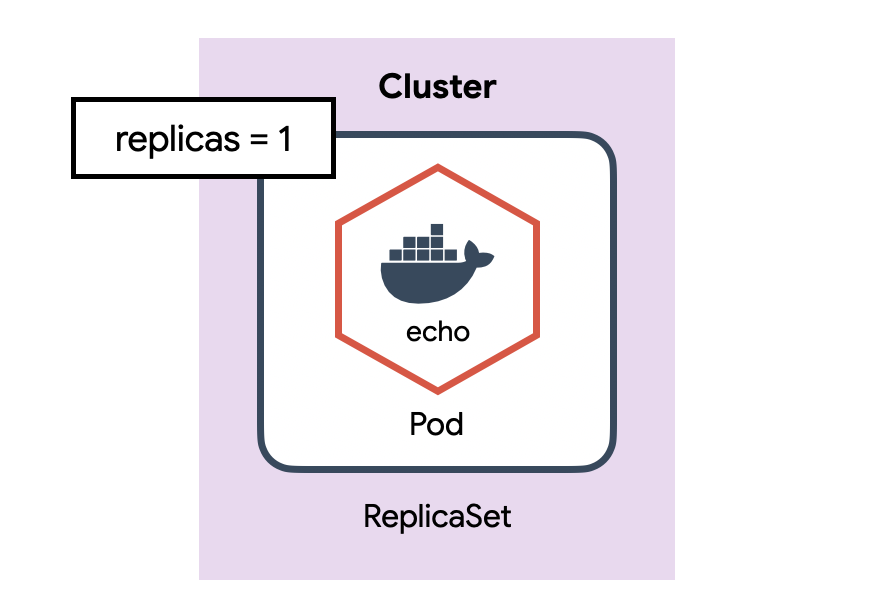
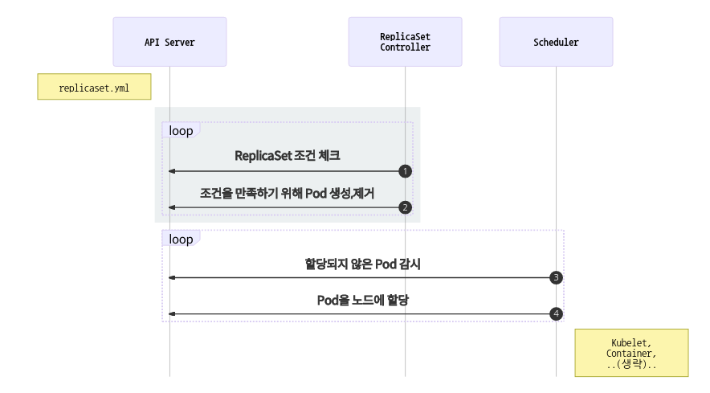

# ReplicaSet

- Pod을 단독으로 만들면 Pod에 어떤 문제(서버가 죽어서 Pod이 사라졌다던가)가 생겼을 때 자동으로 복구되지 않습니다. 이러한 Pod을 정해진 수만큼 복제하고 관리하는 것이 ReplicaSet입니다.

## ReplicaSet 만들기

| 정의          | 설명              |
| ------------- | ----------------- |
| spec.selector | label 체크 조건   |
| spec.replicas | 원하는 Pod의 개수 |
| spec.template | 생성할 Pod의 명세 |

```yml
# guide/replicaset/echo-rs.yml
apiVersion: apps/v1
kind: ReplicaSet
metadata:
  name: echo-rs
spec:
  replicas: 1
  selector:
    matchLabels:
      app: echo
      tier: app
  template:
    metadata:
      labels:
        app: echo
        tier: app
    spec:
      containers:
        - name: echo
          image: ghcr.io/subicura/echo:v1
```

```bash
# ReplicaSet 생성
kubectl apply -f echo-rs.yml

# 리소스 확인
kubectl get po,rs

# 생성된 Pod의 label을 확인
kubectl get pod --show-labels

# app- 를 지정하면 app label을 제거
kubectl label pod/echo-rs-tcdwj app- # 환경마다 이름이 다릅니다

# 다시 Pod 확인
kubectl get pod --show-labels

# app- 를 지정하면 app label을 제거
kubectl label pod/echo-rs-tcdwj app=echo # 환경마다 이름이 다릅니다

# 다시 Pod 확인
kubectl get pod --show-labels


# ReplicaSet 제거
kubectl delete -f echo-rs.yml
```

- 
- ReplicaSet이 어떻게 동작하는지 살펴봅니다.
  
  1. ReplicaSet Controller는 ReplicaSet조건을 감시하면서 현재 상태와 원하는 상태가 다른 것을 체크
  2. ReplicaSet Controller가 원하는 상태가 되도록 Pod을 생성하거나 제거
  3. Scheduler는 API서버를 감시하면서 할당되지 않은unassigned Pod이 있는지 체크
  4. Scheduler는 할당되지 않은 새로운 Pod을 감지하고 적절한 노드node에 배치
  5. 이후 노드는 기존대로 동작  
     ReplicaSet은 ReplicaSet Controller가 관리하고 Pod의 할당은 여전히 Scheduler가 관리합니다. 각자 맡은 역할을 충실히 수행하는 모습이 보기 좋습니다.

## 스케일 아웃

- ReplicaSet을 이용하면 손쉽게 Pod을 여러개로 복제할 수 있습니다.

```yml
# guide/replicaset/echo-rs-scaled.yml
apiVersion: apps/v1
kind: ReplicaSet
metadata:
  name: echo-rs
spec:
  replicas: 4
  selector:
    matchLabels:
      app: echo
      tier: app
  template:
    metadata:
      labels:
        app: echo
        tier: app
    spec:
      containers:
        - name: echo
          image: ghcr.io/subicura/echo:v1
```

```bash
# ReplicaSet 생성
kubectl apply -f echo-rs-scaled.yml

# Pod 확인
kubectl get pod,rs

# ReplicaSet 제거
kubectl delete -f echo-rs-scaled.yml
```

## 마무리

- ReplicaSet은 원하는 개수의 Pod을 유지하는 역할을 담당합니다. label을 이용하여 Pod을 체크하기 때문에 label이 겹치지 않게 신경써서 정의해야 합니다.
- 실전에서 ReplicaSet을 단독으로 쓰는 경우는 거의 없습니다. 바로 다음에서 배울 Deployment가 ReplicaSet을 이용하고 주로 Deployment를 사용합니다.

## 실습

| 키                  | 값           |
| ------------------- | ------------ |
| ReplicaSet 이름     | nginx        |
| ReplicaSet selector | app: nginx   |
| ReplicaSet 복제수   | 3            |
| Container 이름      | nginx        |
| Container 이미지    | nginx:latest |

```yml
# guide/replicaset/replicaset_exam1.yml
apiVersion: apps/v1
kind: ReplicaSet
metadata:
  name: nginx
spec:
  replicas: 3
  selector:
    matchLabels:
      app: nginx
  template:
    metadata:
      labels:
        app: nginx
    spec:
      containers:
        - name: nginx
          image: nginx:latest
```
