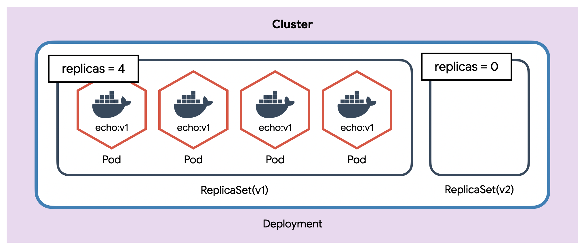
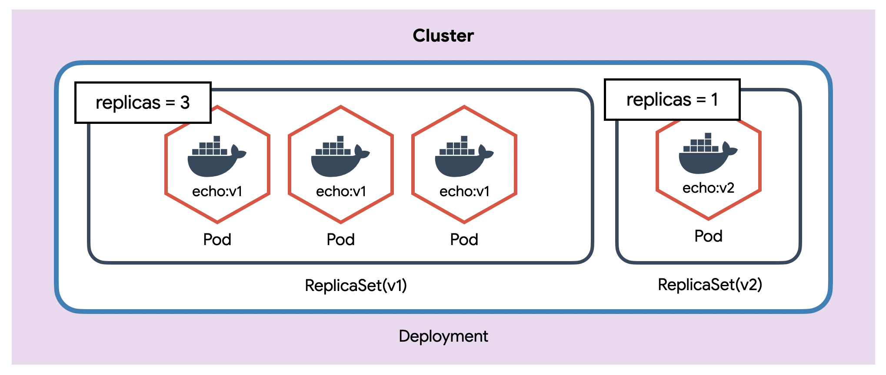
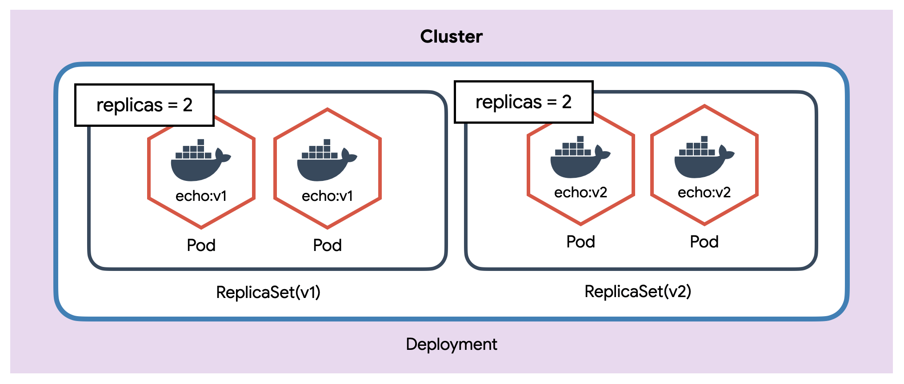
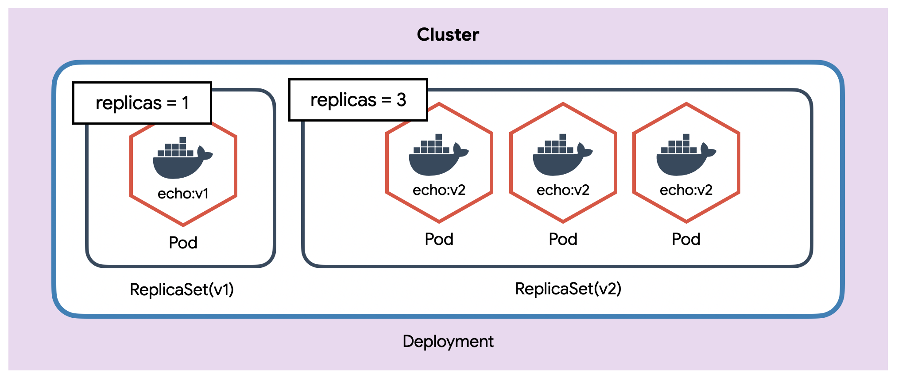
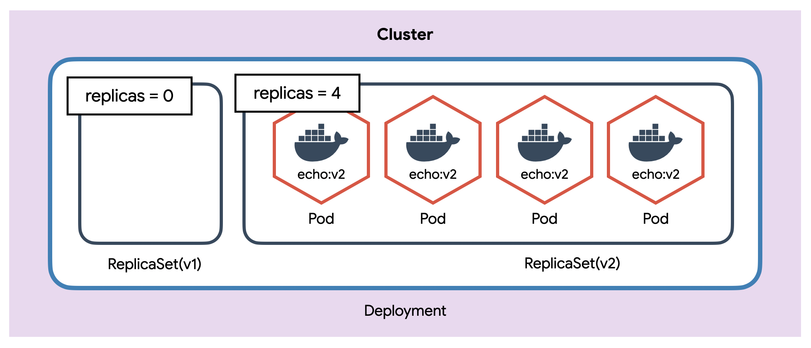
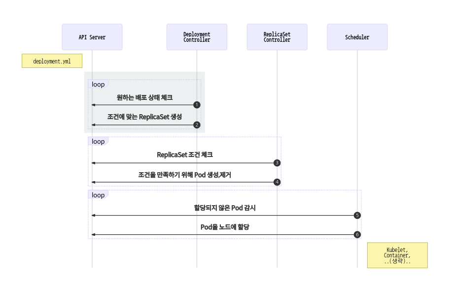

> 리소스 제거  
> 실습이 끝나면 delete 명령어로 리소스를 제거해주세요.

# Deployment

- Deployment는 쿠버네티스에서 가장 널리 사용되는 오브젝트입니다. ReplicaSet을 이용하여 Pod을 업데이트하고 이력을 관리하여 롤백Rollback하거나 특정 버전revision으로 돌아갈 수 있습니다.

## Deployment 만들기

- type을 제외하곤 ReplicaSet과 완전히 동일

```yml
# guide/deployment/echo-deployment.yml
apiVersion: apps/v1
kind: Deployment
metadata:
  name: echo-deploy
spec:
  replicas: 4
  selector:
    matchLabels:
      app: echo
      tier: app
  template:
    metadata:
      labels:
        app: echo
        tier: app
    spec:
      containers:
        - name: echo
          image: ghcr.io/subicura/echo:v1
```

```bash
# Deployment 생성
kubectl apply -f echo-deployment.yml

# 리소스 확인
kubectl get po,rs,deploy
```

- Pod 업데이트
  > 엄밀히 말하면 "Pod을 새로운 버전으로 업데이트한다"는 건 잘못된 표현이고, "새로운 버전의 Pod을 생성하고 기존 Pod을 제거한다"가 정확한 표현입니다.

```yml
# guide/deployment/echo-deployment-v2.yml
apiVersion: apps/v1
kind: Deployment
metadata:
  name: echo-deploy
spec:
  replicas: 4
  selector:
    matchLabels:
      app: echo
      tier: app
  template:
    metadata:
      labels:
        app: echo
        tier: app
    spec:
      containers:
        - name: echo
          image: ghcr.io/subicura/echo:v2 # 이미지 태그만 변경
```

```bash
# 새로운 이미지 업데이트
kubectl apply -f echo-deployment-v2.yml

# 리소스 확인
kubectl get po,rs,deploy

# Deployment의 상세 상태
kubectl describe deploy/echo-deploy
```

1. Deployment는 새로운 이미지로 업데이트하기 위해 ReplicaSet을 이용합니다. 버전을 업데이트하면 새로운 ReplicaSet을 생성하고 해당 ReplicaSet이 새로운 버전의 Pod을 생성합니다.
   
2. 새로운 ReplicaSet을 0 -> 1개로 조정하고 정상적으로 Pod이 동작하면 기존 ReplicaSet을 4 -> 3개로 조정합니다.
   
3. 새로운 ReplicaSet을 1 -> 2개로 조정하고 정상적으로 Pod이 동작하면 기존 ReplicaSet을 3 -> 2개로 조정합니다.
   
4. 새로운 ReplicaSet을 2 -> 3개로 조정하고 정상적으로 Pod이 동작하면 기존 ReplicaSet을 2 -> 1개로 조정합니다.
   
5. 최종적으로 새로운 ReplicaSet을 4개로 조정하고 정상적으로 Pod이 동작하면 기존 ReplicaSet을 0개로 조정합니다. 🎉 업데이트 완료!
   
6. 동작방식
   

   1. Deployment Controller는 Deployment조건을 감시하면서 현재 상태와 원하는 상태가 다른 것을 체크
   2. Deployment Controller가 원하는 상태가 되도록 ReplicaSet 설정
   3. ReplicaSet Controller는 ReplicaSet조건을 감시하면서 현재 상태와 원하는 상태가 다른 것을 체크
   4. ReplicaSet Controller가 원하는 상태가 되도록 Pod을 생성하거나 제거
   5. Scheduler는 API서버를 감시하면서 할당되지 않은unassigned Pod이 있는지 체크
   6. Scheduler는 할당되지 않은 새로운 Pod을 감지하고 적절한 노드node에 배치
   7. 이후 노드는 기존대로 동작

   Deployment는 Deployment Controller가 관리하고 ReplicaSet과 Pod은 기존 Controller와 Scheduler가 관리합니다.

## 버전관리

```bash
# 히스토리 확인
kubectl rollout history deploy/echo-deploy

# revision 1 히스토리 상세 확인
kubectl rollout history deploy/echo-deploy --revision=1

# 바로 전으로 롤백
kubectl rollout undo deploy/echo-deploy

# 특정 버전으로 롤백
kubectl rollout undo deploy/echo-deploy --to-revision=2

# Deployment 제거
kubectl delete -f echo-deployment-v2.yml
```

## 배포 전략 설정

- Deployment 다양한 방식의 배포 전략이 있습니다. 여기선 롤링업데이트**RollingUpdate** 방식을 사용할 때 동시에 업데이트하는 Pod의 개수를 변경해보겠습니다.

```yml
# guide/deployment/echo-strategy.yml
apiVersion: apps/v1
kind: Deployment
metadata:
  name: echo-deploy-st
spec:
  replicas: 4
  selector:
    matchLabels:
      app: echo
      tier: app
  minReadySeconds: 5
  strategy:
    type: RollingUpdate
    rollingUpdate:
      maxSurge: 3
      maxUnavailable: 3
  template:
    metadata:
      labels:
        app: echo
        tier: app
    spec:
      containers:
        - name: echo
          image: ghcr.io/subicura/echo:v1
          livenessProbe:
            httpGet:
              path: /
              port: 3000
```

```bash
# Deployment 생성
kubectl apply -f echo-strategy.yml

# 리소스 확인
kubectl get po,rs,deploy

# 이미지 변경 (명령어로)
kubectl set image deploy/echo-deploy-st echo=ghcr.io/subicura/echo:v2

# 이벤트 확인
kubectl describe deploy/echo-deploy-st

# Deployment 제거
kubectl delete -f echo-strategy.yml
```

> 배포 전략  
> maxSurge와 maxUnavailable의 기본값은 25%입니다. 대부분의 상황에서 적당하지만 상황에 따라 적절하게 조정이 필요합니다.

## 마무리

Deployment는 가장 흔하게 사용하는 배포방식입니다. 이외에 **StatefulSet**, **DaemonSet**, **CronJob**, **Job**등이 있지만 사용법은 크게 다르지 않습니다.

## 문제

### 문제1

| 키                | 값           |
| ----------------- | ------------ |
| Deployment 이름   | nginx        |
| Deployment Label  | app: nginx   |
| Deployment 복제수 | 3            |
| Container 이름    | nginx        |
| Container 이미지  | nginx:1.14.2 |

```yml
# guide/deployment/deploy_exam1.yml
apiVersion: apps/v1
kind: Deployment
metadata:
  name: nginx
spec:
  replicas: 3
  selector:
    matchLabels:
      app: nginx
  template:
    metadata:
      labels:
        app: nginx
    spec:
      containers:
        - name: nginx
          image: nginx:1.14.2
```

### 문제2

```yml
# guide/deployment/deploy_exam2.yml
apiVersion: apps/v1
kind: Deployment
metadata:
  name: nginx
spec:
  replicas: 5 # 문제1에서 수정
  selector:
    matchLabels:
      app: nginx
  template:
    metadata:
      labels:
        app: nginx
    spec:
      containers:
        - name: nginx
          image: nginx:1.14.2
```

### 문제3

```yml
# guide/deployment/deploy_exam3.yml
apiVersion: apps/v1
kind: Deployment
metadata:
  name: nginx
spec:
  replicas: 5
  selector:
    matchLabels:
      app: nginx
  template:
    metadata:
      labels:
        app: nginx
    spec:
      containers:
        - name: nginx
          image: nginx:1.19.5 # 문제2에서 수정
```
