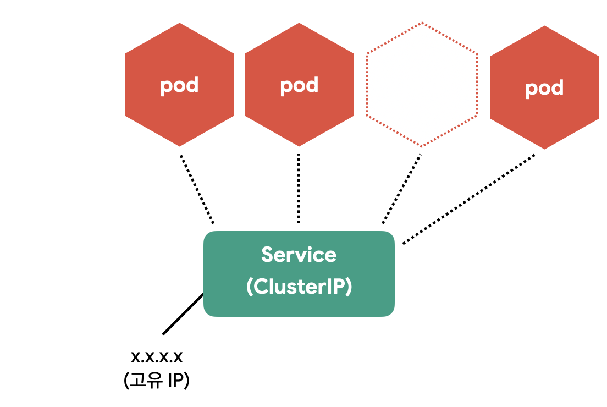
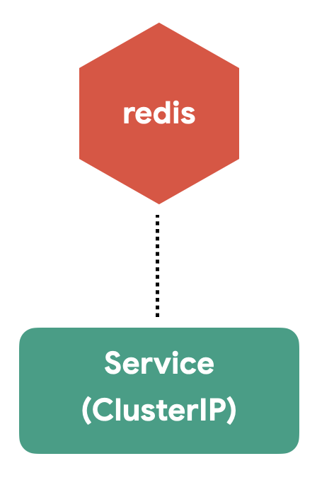
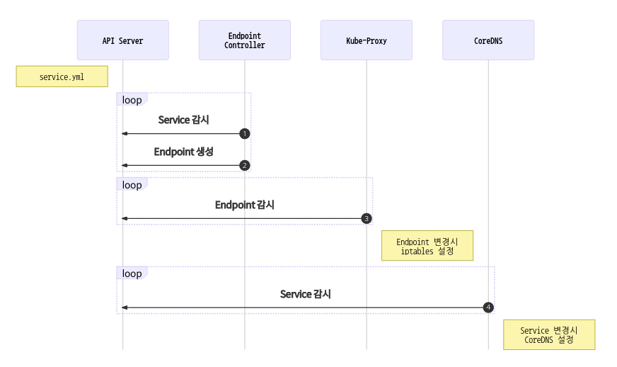
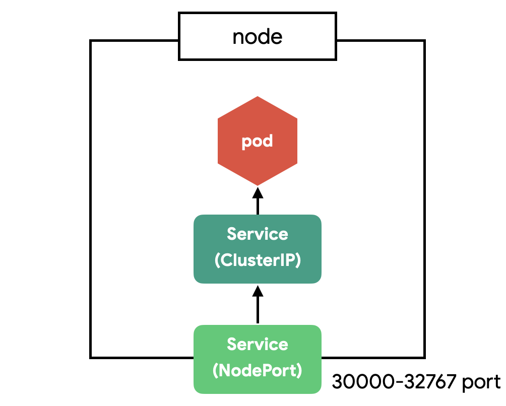
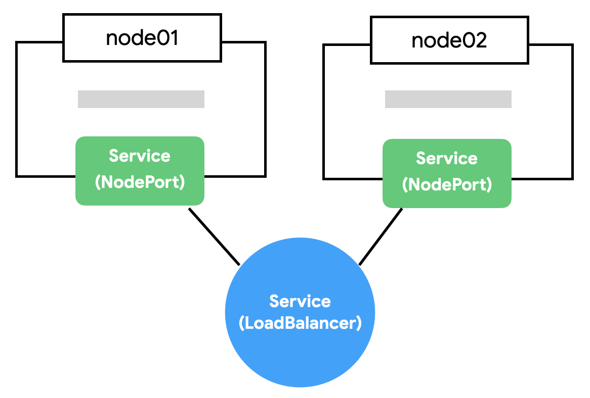

> 리소스 제거  
> 실습이 끝나면 delete 명령어로 리소스를 제거해주세요.

# Service

- Pod은 자체 IP를 가지고 다른 Pod과 통신할 수 있지만, 쉽게 사라지고 생성되는 특징 때문에 직접 통신하는 방법은 권장하지 않습니다. 쿠버네티스는 Pod과 직접 통신하는 방법 대신, 별도의 고정된 IP를 가진 서비스를 만들고 그 서비스를 통해 Pod에 접근하는 방식을 사용합니다.

  

## Service(ClusterIP) 만들기

- ClusterIP는 클러스터 내부에 새로운 IP를 할당하고 여러 개의 Pod을 바라보는 로드밸런서 기능을 제공합니다. 그리고 서비스 이름을 내부 도메인 서버에 등록하여 Pod 간에 서비스 이름으로 통신할 수 있습니다.

> 구분자  
> 하나의 YAML파일에 여러 개의 리소스를 정의할 땐 "---"를 구분자로 사용합니다.

redis를 서비스로 노출

```yml
# guide/service/counter-redis-svc.yml
apiVersion: apps/v1
kind: Deployment
metadata:
  name: redis
spec:
  selector:
    matchLabels:
      app: counter
      tier: db
  template:
    metadata:
      labels:
        app: counter
        tier: db
    spec:
      containers:
        - name: redis
          image: redis
          ports:
            - containerPort: 6379
              protocol: TCP

---
apiVersion: v1
kind: Service
metadata:
  name: redis
spec:
  ports:
    - port: 6379
      protocol: TCP
  selector:
    app: counter
    tier: db
```

```bash
# Service / Deployment 생성
kubectl apply -f counter-redis-svc.yml

# Pod, ReplicaSet, Deployment, Service 상태 확인
kubectl get all
```

- 같은 클러스터에서 생성된 Pod이라면 redis라는 도메인으로 redis Pod에 접근 할 수 있습니다. (redis.default.svc.cluster.local로도 접근가능 합니다. 서로 다른 namespace와 cluster를 구분할 수 있습니다.)
  
- | 정의                  | 설명                                           |
  | --------------------- | ---------------------------------------------- |
  | spec.ports.port       | 서비스가 생성할 Port                           |
  | spec.ports.targetPort | 서비스가 접근할 Pod의 Port (기본: port랑 동일) |
  | spec.selector         | 서비스가 접근할 Pod의 label 조건               |

redis에 접근할 counter 앱을 Deployment로 만듭니다.

```yml
# guide/service/counter-app.yml
apiVersion: apps/v1
kind: Deployment
metadata:
  name: counter
spec:
  selector:
    matchLabels:
      app: counter
      tier: app
  template:
    metadata:
      labels:
        app: counter
        tier: app
    spec:
      containers:
        - name: counter
          image: ghcr.io/subicura/counter:latest
          env:
            - name: REDIS_HOST
              value: "redis"
            - name: REDIS_PORT
              value: "6379"
```

```bash
# Deployment 생성
kubectl apply -f counter-app.yml

# counter app에 접근
kubectl get po
kubectl exec -it counter-<xxxxx> -- sh

apk add curl busybox-extras # install telnet
curl localhost:3000
curl localhost:3000
telnet redis 6379

  dbsize
  KEYS *
  GET count
  quit

exit
```

## Service 생성 흐름



1. Endpoint Controller는 Service와 Pod을 감시하면서 조건에 맞는 Pod의 IP를 수집
2. Endpoint Controller가 수집한 IP를 가지고 Endpoint 생성
3. Kube-Proxy는 Endpoint 변화를 감시하고 노드의 iptables을 설정
4. CoreDNS는 Service를 감시하고 서비스 이름과 IP를 CoreDNS에 추가

Endpoint의 상태를 확인

```bash
kubectl get endpoints
kubectl get ep #줄여서

# redis Endpoint 확인
kubectl describe ep/redis
```

## Service(NodePort) 만들기

- CluterIP는 클러스터 내부에서만 접근할 수 있습니다. 클러스터 외부(노드)에서 접근할 수 있도록 NodePort 서비스를 만들어봅니다.

```yml
# guide/service/counter-nodeport.yml
apiVersion: v1
kind: Service
metadata:
  name: counter-np
spec:
  type: NodePort
  ports:
    - port: 3000
      protocol: TCP
      nodePort: 31000
  selector:
    app: counter
    tier: app
```

| 정의                | 설명                                                     |
| ------------------- | -------------------------------------------------------- |
| spec.ports.nodePort | 노드에 오픈할 Port (미지정시 30000-32768 중에 자동 할당) |

```bash
# Service(NodePort) 생성
kubectl apply -f counter-nodeport.yml

# 서비스 상태 확인
kubectl get svc

# 클러스터의 노드 IP 확인
minikube ip

curl 192.168.49.2:31000 # 또는 브라우저에서 접근, IPs는 minikube ip 로 확인
```

- NodePort는 클러스터의 모든 노드에 포트를 오픈합니다. 지금은 테스트라서 하나의 노드밖에 없지만 여러 개의 노드가 있다면 아무 노드로 접근해도 지정한 Pod으로 쏘옥 접근할 수 있습니다.
  
  

> NodePort와 ClusterIP  
> NodePort는 CluterIP의 기능을 기본으로 포함합니다.

## Service(LoadBalancer) 만들기

- NodePort의 단점은 노드가 사라졌을 때 자동으로 다른 노드를 통해 접근이 불가능하다는 점입니다. 예를 들어, 3개의 노드가 있다면 3개 중에 아무 노드로 접근해도 NodePort로 연결할 수 있지만 어떤 노드가 살아 있는지는 알 수가 없습니다.
  
- 자동으로 살아 있는 노드에 접근하기 위해 모든 노드를 바라보는 Load Balancer가 필요합니다. 브라우저는 NodePort에 직접 요청을 보내는 것이 아니라 Load Balancer에 요청하고 Load Balancer가 알아서 살아 있는 노드에 접근하면 NodePort의 단점을 없앨 수 있습니다.

```yml
# guide/service/counter-lb.yml
piVersion: v1
kind: Service
metadata:
  name: counter-lb
spec:
  type: LoadBalancer
  ports:
    - port: 30000
      targetPort: 3000
      protocol: TCP
  selector:
    app: counter
    tier: app
```

```bash
# Service(LoadBalancer) 생성
kubectl apply -f counter-lb.yml

# 서비스 상태 확인
kubectl get svc
```

## minikube에 가상 LoadBalancer 만들기

- Load Balancer를 사용할 수 없는 환경에서 가상 환경을 만들어 주는 것이 MetalLB라는 것입니다. minikube에서는 현재 떠 있는 노드를 Load Balancer로 설정합니다. minikube의 addons 명령어로 활성화합니다.

```bash
# metallb설치 - Load Balancer를 사용할 수 없는 환경에서 가상 환경을 만들어 줌
minikube addons enable metallb

# ip 확인
minikube ip
```

```yml
# guide/service/metallb-cm.yml
apiVersion: v1
kind: ConfigMap
metadata:
  namespace: metallb-system
  name: config
data:
  config: |
    address-pools:
    - name: default
      protocol: layer2
      addresses:
      - 192.168.49.2/32 # minikube ip
```

```bash
# ConfigMap 생성
kubectl apply -f metallb-cm.yml

# 다시 서비스 확인
kubectl get svc

curl 192.168.64.4:30000 # 또는 브라우저에서 접근

# 모든 리소스를 삭제
# 첫번째 all 은 모든 리소스에 대한 all,
# 두번째 --all 은 이름대신 모든 리소스
#그라나 secret 은 삭제되지 않는다.
kubectl delete all --all
```

> LoadBalancer와 NodePort  
> LoadBalancer는 NodePort의 기능을 기본으로 포함합니다.

## 마무리

- 서비스는 로우레벨low level 수준의 네트워크를 이해하고 성능, 보안 이슈를 신경 써야 합니다. 파고들면 한없이 복잡하고 어려운 부분으로 일단 그렇구나.. 하고 넘어갑니다. 😭

- 실전에선 NodePort와 LoadBalancer를 제한적으로 사용합니다. 보통 웹 애플리케이션을 배포하면 80 또는 443 포트를 사용하고 하나의 포트에서 여러 개의 서비스를 도메인이나 경로에 따라 다르게 연결하기 때문입니다. 이 부분은 뒤에 Ingress에서 자세히 알아봅니다.

## 참고

[Service v1 core](https://kubernetes.io/docs/reference/generated/kubernetes-api/v1.20/#service-v1-core)  
[네트워크 통신 시각화](https://matthewpalmer.net/kubernetes-app-developer/articles/kubernetes-networking-guide-beginners.html)

## 문제

### 문제1

| 키                | 값                       |
| ----------------- | ------------------------ |
| Deployment 이름   | echo                     |
| Deployment Label  | app: echo                |
| Deployment 복제수 | 3                        |
| Container 이름    | echo                     |
| Container 이미지  | ghcr.io/subicura/echo:v1 |
| NodePort 이름     | echo                     |
| NodePort Port     | 3000                     |
| NodePort NodePort | 32000                    |

```yml
# guide/service/service_exam1.yml
apiVersion: apps/v1
kind: Deployment
metadata:
  name: echo
spec:
  replicas: 3
  selector:
    matchLabels:
      app: echo
  template:
    metadata:
      labels:
        app: echo
    spec:
      containers:
        - name: echo
          image: ghcr.io/subicura/echo:v1

---
apiVersion: v1
kind: Service
metadata:
  name: echo
spec:
  type: NodePort
  ports:
    - port: 3000
      protocol: TCP
      nodePort: 32000
  selector:
    app: echo
```
