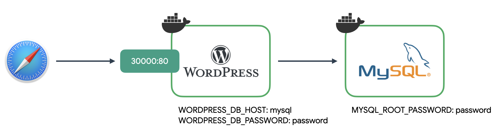

> 리소스 제거  
> 실습이 끝나면 delete 명령어로 리소스를 제거해주세요.

# 웹 애플리케이션 배포

## 워드프레스 배포



MySQL

| 키              | 값                            |
| --------------- | ----------------------------- |
| 컨테이너 이미지 | mysql:5.6                     |
| 포트            | 3306                          |
| 환경변수        | MYSQL_ROOT_PASSWORD: password |

Wordpress

| 키              | 값                                  |
| --------------- | ----------------------------------- |
| 컨테이너 이미지 | wordpress:5.5.3-apache              |
| 포트            | 80                                  |
| 환경변수        | WORDPRESS_DB_HOST: [wordpress host] |
| 환경변수        | WORDPRESS_DB_PASSWORD: password     |

```yml
# guide/sample/wordpress.yml
apiVersion: apps/v1
kind: Deployment
metadata:
  name: wordpress-mysql
  labels:
    app: wordpress
spec:
  selector:
    matchLabels:
      app: wordpress
      tier: mysql
  template:
    metadata:
      labels:
        app: wordpress
        tier: mysql
    spec:
      containers:
        - image: mysql:5.6
          name: mysql
          env:
            - name: MYSQL_ROOT_PASSWORD
              value: password
          ports:
            - containerPort: 3306
              name: mysql

---
apiVersion: v1
kind: Service
metadata:
  name: wordpress-mysql
  labels:
    app: wordpress
spec:
  ports:
    - port: 3306
  selector:
    app: wordpress
    tier: mysql

---
apiVersion: apps/v1
kind: Deployment
metadata:
  name: wordpress
  labels:
    app: wordpress
spec:
  selector:
    matchLabels:
      app: wordpress
      tier: frontend
  template:
    metadata:
      labels:
        app: wordpress
        tier: frontend
    spec:
      containers:
        - image: wordpress:5.5.3-apache
          name: wordpress
          env:
            - name: WORDPRESS_DB_HOST
              value: wordpress-mysql
            - name: WORDPRESS_DB_PASSWORD
              value: password
          ports:
            - containerPort: 80
              name: wordpress

---
apiVersion: v1
kind: Service
metadata:
  name: wordpress
  labels:
    app: wordpress
spec:
  type: NodePort
  ports:
    - port: 80
      nodePort: 30000
  selector:
    app: wordpress
    tier: frontend
```

```bash
# Service / Deployment 생성
kubectl apply -f wordpress.yml

# Pod, ReplicaSet, Deployment, Service 상태 확인
kubectl get all

# 클러스터의 노드 IP 확인
minikube ip

# 웹브라우저
http://192.168.49.2:30000

# 모든 리소스를 삭제
# 첫번째 all 은 모든 리소스에 대한 all,
# 두번째 --all 은 이름대신 모든 리소스
#그라나 secret 은 삭제되지 않는다.
kubectl delete all --all
```

## 투표 애플리케이션 배포


Redis

| 키              | 값           |
| --------------- | ------------ |
| 컨테이너 이미지 | redis:latest |
| 포트            | 6379         |

Postgress

| 키              | 값                          |
| --------------- | --------------------------- |
| 컨테이너 이미지 | postgres:9.4                |
| 포트            | 5432                        |
| 환경변수        | POSTGRES_USER: postgres     |
| 환경변수        | POSTGRES_PASSWORD: postgres |

worker

| 키              | 값                                    |
| --------------- | ------------------------------------- |
| 컨테이너 이미지 | ghcr.io/subicura/voting/worker:latest |
| 환경변수        | REDIS_HOST: [redis ip]                |
| 환경변수        | REDIS_PORT: [redis port]              |
| 환경변수        | POSTGRES_HOST: [postgres ip]          |
| 환경변수        | POSTGRES_PORT: [postgres port]        |

vote

> 노드 31000으로 연결

| 키              | 값                                  |
| --------------- | ----------------------------------- |
| 컨테이너 이미지 | ghcr.io/subicura/voting/vote:latest |
| 포트            | 80                                  |
| 환경변수        | REDIS_HOST: [redis ip]              |
| 환경변수        | REDIS_PORT: [redis port]            |

result

> 노드 31001으로 연결

| 키              | 값                                    |
| --------------- | ------------------------------------- |
| 컨테이너 이미지 | ghcr.io/subicura/voting/result:latest |
| 포트            | 80                                    |
| 환경변수        | POSTGRES_HOST: [postgres ip]          |
| 환경변수        | POSTGRES_PORT: [postgres port]        |

```yml
# guide/sample/vote.yml
apiVersion: apps/v1
kind: Deployment
metadata:
  name: vote
spec:
  selector:
    matchLabels:
      service: vote
  template:
    metadata:
      labels:
        service: vote
    spec:
      containers:
        - name: vote
          image: ghcr.io/subicura/voting/vote
          env:
            - name: REDIS_HOST
              value: "redis"
            - name: REDIS_PORT
              value: "6379"
          livenessProbe:
            httpGet:
              path: /
              port: 80
          readinessProbe:
            httpGet:
              path: /
              port: 80
          ports:
            - containerPort: 80
              protocol: TCP

---
apiVersion: v1
kind: Service
metadata:
  name: vote
spec:
  type: NodePort
  ports:
    - port: 80
      nodePort: 31000
      protocol: TCP
  selector:
    service: vote

---
apiVersion: apps/v1
kind: Deployment
metadata:
  name: result
spec:
  selector:
    matchLabels:
      service: result
  template:
    metadata:
      labels:
        service: result
    spec:
      containers:
        - name: result
          image: ghcr.io/subicura/voting/result
          env:
            - name: POSTGRES_HOST
              value: "db"
            - name: POSTGRES_PORT
              value: "5432"
          livenessProbe:
            httpGet:
              path: /
              port: 80
          readinessProbe:
            httpGet:
              path: /
              port: 80
          ports:
            - containerPort: 80
              protocol: TCP

---
apiVersion: v1
kind: Service
metadata:
  name: result
spec:
  type: NodePort
  ports:
    - port: 80
      nodePort: 31001
      protocol: TCP
  selector:
    service: result

---
apiVersion: apps/v1
kind: Deployment
metadata:
  name: worker
spec:
  selector:
    matchLabels:
      service: worker
  template:
    metadata:
      labels:
        service: worker
    spec:
      containers:
        - name: worker
          image: ghcr.io/subicura/voting/worker
          env:
            - name: REDIS_HOST
              value: "redis"
            - name: REDIS_PORT
              value: "6379"
            - name: POSTGRES_HOST
              value: "db"
            - name: POSTGRES_PORT
              value: "5432"

---
apiVersion: apps/v1
kind: Deployment
metadata:
  name: redis
spec:
  selector:
    matchLabels:
      service: redis
  template:
    metadata:
      labels:
        service: redis
    spec:
      containers:
        - name: redis
          image: redis
          ports:
            - containerPort: 6379
              protocol: TCP

---
apiVersion: v1
kind: Service
metadata:
  name: redis
spec:
  ports:
    - port: 6379
      protocol: TCP
  selector:
    service: redis

---
apiVersion: apps/v1
kind: Deployment
metadata:
  name: db
spec:
  selector:
    matchLabels:
      service: db
  template:
    metadata:
      labels:
        service: db
    spec:
      containers:
        - name: db
          image: postgres:9.4
          env:
            - name: POSTGRES_USER
              value: "postgres"
            - name: POSTGRES_PASSWORD
              value: "postgres"
          ports:
            - containerPort: 5432
              protocol: TCP

---
apiVersion: v1
kind: Service
metadata:
  name: db
spec:
  ports:
    - port: 5432
      protocol: TCP
  selector:
    service: db
```

```bash
# Service / Deployment 생성
kubectl apply -f vote.yml

# Pod, ReplicaSet, Deployment, Service 상태 확인
kubectl get all

# 클러스터의 노드 IP 확인
minikube ip

# 웹브라우저
http://192.168.49.2:31000
http://192.168.49.2:31001

# 모든 리소스를 삭제
# 첫번째 all 은 모든 리소스에 대한 all,
# 두번째 --all 은 이름대신 모든 리소스
#그라나 secret 은 삭제되지 않는다.
kubectl delete all --all
```
