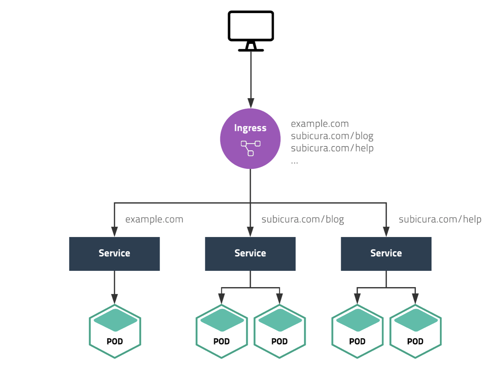
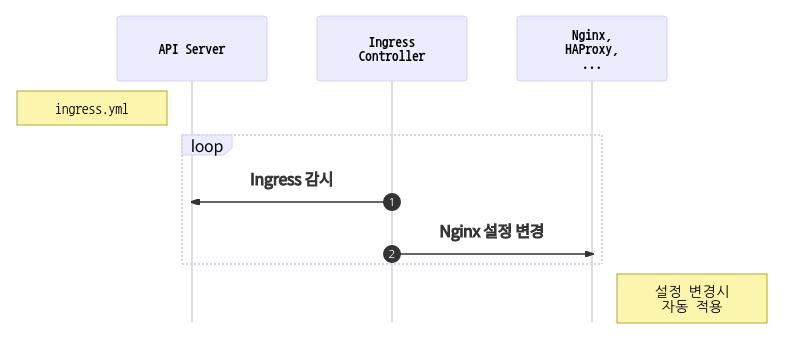

> 리소스 제거  
> 실습이 끝나면 delete 명령어로 리소스를 제거해주세요.

# Ingress

- 하나의 클러스터에서 여러 가지 서비스를 운영한다면 외부 연결을 어떻게 할까요? NodePort를 이용하면 서비스 개수만큼 포트를 오픈하고 사용자에게 어떤 포트인지 알려줘야 합니다. 그럴순 없죠!
  
  위 샘플은 example.com, subicura.com/blog, subicura.com/help 주소로 서로 다른 서비스에 접근하는 모습입니다. 80(http) 또는 443(https) 포트로 여러 개의 서비스를 연결해야 하는데 이럴 때 Ingress를 사용합니다.

## Ingress 만들기

minikube ip로 테스트 클러스터의 노드 IP를 구하고 도메인 주소로 사용합니다. 결과 IP가 192.168.64.5라면 사용할 도메인은 다음과 같습니다.

- v1.echo.192.168.64.5.sslip.io
- v2.echo.192.168.64.5.sslip.io

### minikube에 Ingress 활성화하기

- Ingress는 Pod, ReplicaSet, Deployment, Service와 달리 별도의 컨트롤러를 설치해야 합니다. 여러 가지 컨트롤러 중에 입맛에 맞게 고를 수 있는데 여기서는 nginx ingress controller를 사용합니다.

```bash
# ingress 컨트롤러 설치
minikube addons enable ingress

# ingress 컨트롤러 확인
kubectl -n kube-system get pod

# 클러스터의 노드 IP 확인
minikube ip

curl -I http://192.168.49.2/healthz # minikube ip를 입력
```

### echo 웹 애플리케이션 배포

- v1, v2 2가지를 배포
- Ingress Spec중에 rules.host부분을 minikube ip로 변경

```yml
# guide/ingress/echo-v1.yml
apiVersion: networking.k8s.io/v1
kind: Ingress
metadata:
  name: echo-v1
spec:
  rules:
    - host: v1.echo.192.168.49.2.sslip.io # minikube ip를 입력
      http:
        paths:
          - path: /
            pathType: Prefix
            backend:
              service:
                name: echo-v1
                port:
                  number: 3000

---
apiVersion: apps/v1
kind: Deployment
metadata:
  name: echo-v1
spec:
  replicas: 3 # 원하는 Pod의 개수
  selector:
    matchLabels:
      app: echo
      tier: app
      version: v1
  template:
    metadata:
      labels:
        app: echo
        tier: app
        version: v1
    spec:
      containers:
        - name: echo
          image: ghcr.io/subicura/echo:v1
          livenessProbe:
            httpGet:
              path: /
              port: 3000

---
apiVersion: v1
kind: Service
metadata:
  name: echo-v1
spec:
  ports:
    - port: 3000
      protocol: TCP
  selector:
    app: echo
    tier: app
    version: v1
```

```yml
# guide/ingress/echo-v2.yml
apiVersion: networking.k8s.io/v1
kind: Ingress
metadata:
  name: echo-v2
spec:
  rules:
    - host: v2.echo.192.168.49.2.sslip.io # minikube ip를 입력
      http:
        paths:
          - path: /
            pathType: Prefix
            backend:
              service:
                name: echo-v2
                port:
                  number: 3000

---
apiVersion: apps/v1
kind: Deployment
metadata:
  name: echo-v2
spec:
  replicas: 3 # 원하는 Pod의 개수
  selector:
    matchLabels:
      app: echo
      tier: app
      version: v2
  template:
    metadata:
      labels:
        app: echo
        tier: app
        version: v2
    spec:
      containers:
        - name: echo
          image: ghcr.io/subicura/echo:v2
          livenessProbe:
            httpGet:
              path: /
              port: 3000

---
apiVersion: v1
kind: Service
metadata:
  name: echo-v2
spec:
  ports:
    - port: 3000
      protocol: TCP
  selector:
    app: echo
    tier: app
    version: v2
```

```bash
# Deployment, Service, Ingress를 생성
kubectl apply -f echo-v1.yml,echo-v2.yml

# Ingress 상태 확인
kubectl get ingress
kubectl get ing # ingress 줄임

curl http://v1.echo.192.168.49.2.sslip.io # minikube ip를 입력
curl http://v2.echo.192.168.49.2.sslip.io # minikube ip를 입력

# 모든 리소스를 삭제
# 첫번째 all 은 모든 리소스에 대한 all,
# 두번째 --all 은 이름대신 모든 리소스
#그라나 secret 은 삭제되지 않는다.
kubectl delete all --all
```



1. Ingress Controller는 Ingress 변화를 체크
2. Ingress Controller는 변경된 내용을 Nginx에 설정하고 프로세스 재시작

동작방식을 보면 YAML로 만든 Ingress 설정을 단순히 nginx 설정으로 바꾸는 걸 알 수 있습니다. 이러한 과정을 수동으로 하지 않고 Ingress Controller가 하는 것 뿐입니다.

Ingress는 도메인, 경로만 연동하는 것이 아니라 요청 timeout, 요청 max size 등 다양한 프록시 서버 설정을 할 수 있습니다. 상세 설정은 추후 고급편에서 다시 다루겠습니다.

## 마무리

- Ingress를 사용하면 YAML 설정만으로 도메인, 경로 설정을 손쉽게 할 수 있습니다. 기존에 도메인을 연결하려면 담당자에게 요청하고 설정 파일을 변경한 다음 프로세스 재시작까지 수동으로 작업했는데, 더 이상 그런 과정을 거치지 않아도 됩니다.

## 참고

[Ingress v1 networking.k8s.io](https://kubernetes.io/docs/reference/generated/kubernetes-api/v1.20/#ingress-v1-networking-k8s-io)

## 문제

### 문제1

| 키                | 값                 |
| ----------------- | ------------------ |
| Deployment 이름   | nginx              |
| Deployment Label  | app: nginx         |
| Deployment 복제수 | 3                  |
| Container 이름    | nginx              |
| Container 이미지  | nginx:latest       |
| Ingress 도메인    | nginx.xxx.sslip.io |

```yml
# guide/ingress/ingress_exam1.yml
apiVersion: networking.k8s.io/v1
kind: Ingress
metadata:
  name: nginx
spec:
  rules:
    - host: nginx.192.168.49.2.sslip.io # minikube ip를 입력
      http:
        paths:
          - path: /
            pathType: Prefix
            backend:
              service:
                name: nginx
                port:
                  number: 80

---
apiVersion: apps/v1
kind: Deployment
metadata:
  name: nginx
spec:
  replicas: 3
  selector:
    matchLabels:
      app: nginx
  template:
    metadata:
      labels:
        app: nginx
    spec:
      containers:
        - name: echo
          image: nginx:latest

---
apiVersion: v1
kind: Service
metadata:
  name: nginx
spec:
  ports:
    - port: 80
      protocol: TCP
  selector:
    app: nginx
```

```bash
# Deployment, Service, Ingress를 생성
kubectl apply -f ingress_exam1.yml

# Ingress 상태 확인
kubectl get ingress
kubectl get ing # ingress 줄임

curl http://nginx.192.168.49.2.sslip.io # minikube ip를 입력

# 모든 리소스를 삭제
# 첫번째 all 은 모든 리소스에 대한 all,
# 두번째 --all 은 이름대신 모든 리소스
#그라나 secret 은 삭제되지 않는다.
kubectl delete all --all
```
