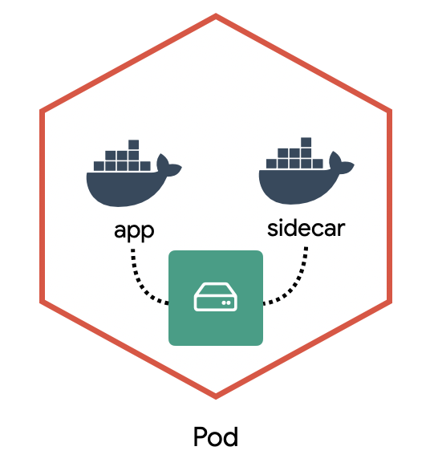
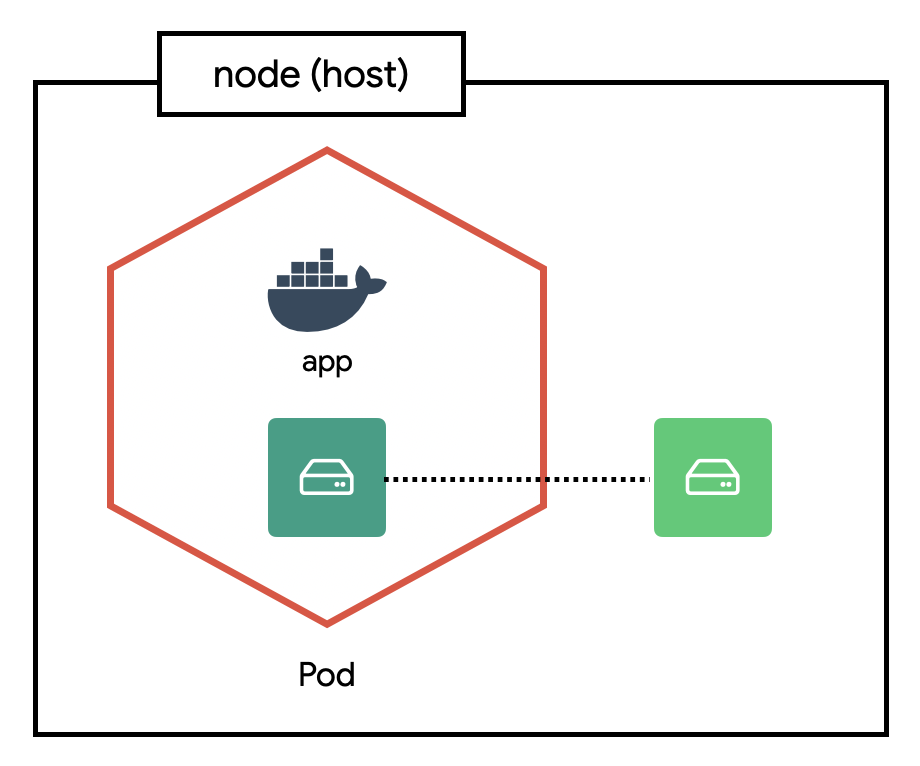

> 리소스 제거  
> 실습이 끝나면 delete 명령어로 리소스를 제거해주세요.

# Volume (local)

- 지금까지 만들었던 컨테이너는 Pod을 제거하면 컨테이너 내부에 저장했던 데이터도 모두 사라집니다. MySQL과 같은 데이터베이스는 데이터가 유실되지 않도록 반드시 별도의 저장소에 데이터를 저장하고 컨테이너를 새로 만들 때 이전 데이터를 가져와야 합니다.

- 쿠버네티스는 Volume을 이용하여 컨테이너의 디렉토리를 외부 저장소와 연결하고 다양한 플러그인을 지원하여 흔히 사용하는 대부분의 스토리지를 별도 설정없이 사용할 수 있습니다.

- 실전에서는 awsElasticBlockStore(aws), azureDisk(azure), gcePersistentDisk(google cloud)와 같은 volume을 사용하지만 이를 테스트하기 위해서는 실제 클라우드를 사용해야 하므로 이번엔 간단하게 로컬 저장소를 사용하는 법만 알아봅니다.

## Volume 만들기

### empty-dir

- Pod 안에 속한 컨테이너 간 디렉토리를 공유하는 방법을 알아봅니다.
- 보통 사이드카sidecar라는 패턴에서 사용합니다. 예를 들면, 특정 컨테이너에서 생성되는 로그 파일을 별도의 컨테이너(사이드카)가 수집 할 수 있습니다.
  
  - app 컨테이너는 /var/log/example.log에 로그 파일을 만들고 sidecar 컨테이너는 해당 로그 파일을 처리하도록 합니다.

```yml
# guide/local-volume/empty-dir.yml
apiVersion: v1
kind: Pod
metadata:
  name: sidecar
spec:
  containers:
    - name: app
      image: busybox
      args:
        - /bin/sh
        - -c
        - >
          while true;
          do
            echo "$(date)\n" >> /var/log/example.log;
            sleep 1;
          done
      volumeMounts:
        - name: varlog
          mountPath: /var/log
    - name: sidecar
      image: busybox
      args: [/bin/sh, -c, "tail -f /var/log/example.log"]
      volumeMounts:
        - name: varlog
          mountPath: /var/log
  volumes:
    - name: varlog
      emptyDir: {}
```

```bash
kubectl apply -f empty-dir.yml

# sidecar 로그 확인
kubectl logs -f sidecar -c sidecar

kubectl delete -f empty-dir.yml
```

### hostpath

- 호스트 디렉토리를 컨테이너 디렉토리에 연결하는 방법을 알아봅니다. 여기서는 호스트의 /var/log 디렉토리를 연결하여 내용을 확인해 보겠습니다.
  

```yml
# guide/local-volume/hostpath.yml
apiVersion: v1
kind: Pod
metadata:
  name: host-log
spec:
  containers:
    - name: log
      image: busybox
      args: ["/bin/sh", "-c", "sleep infinity"]
      volumeMounts:
        - name: varlog
          mountPath: /host/var/log
  volumes:
    - name: varlog
      hostPath:
        path: /var/log
```

```bash
kubectl apply -f hostpath.yml

# 컨테이너 접속 후 /host/var/log 디렉토리를 확인
kubectl exec -it host-log -- sh
ls -al /host/var/log
```

## 마무리

- 쿠버네티스는 volume을 연결하는 방법을 추상화하고 다양한 플러그인을 지원합니다. 따라서, 설정하는 법이 조금 복잡해 보일 수 있지만 한번 Spec을 이해하면 다른 volume도 쉽게 연결할 수 있습니다.

## 참고

[Volume v1 core](https://kubernetes.io/docs/reference/generated/kubernetes-api/v1.20/#volume-v1-core)
