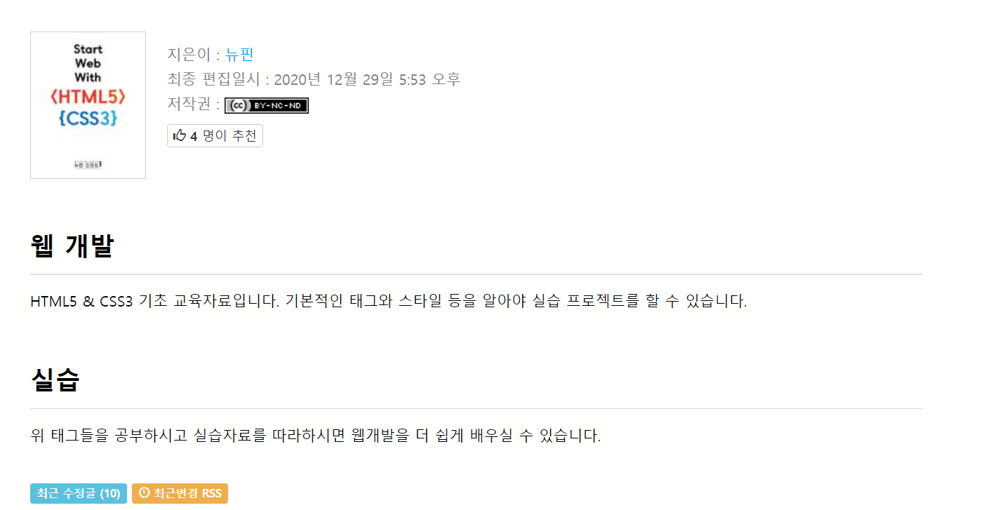

# [웹을 알고싶다면?? HTML5 & CSS3부터 !!!](https://wikidocs.net/book/4701)

# 웹을 알고싶다면?? HTML5 & CSS3부터

01장 오리엔테이션

- 01장-1 머릿말
- 01장-2 WEB이란
- 01장-3 HTML5 & CSS3
- 01장-4 학습 목표

---

02장 HTML5에 대해서

- 02장-1 실습을 위한 Editor
- 02장-2 HTML5 기본구조과 기본태그
  - [HTML 기본구조](02-2.0.html)
  - HTML 기본태그
    1. [HTML Headings](02-2.1.html)
    2. [HTML Paragraphs](02-2.2.html)
    3. [HTML Text Formatting](02-2.3.html)
    4. [HTML Quotation/Comment](02-2.4.html)
    5. [HTML Links](02-2.5.html)
    6. [HTML Image](02-2.6.html)
    7. [HTML List](02-2.7.html)
    8. [HTML Table](02-2.8.html)
- 02장-3 HTML 공간 배치
  - [02장-3.1 HTML block & inline](02-3.1.html)
  - [02장-3.2 HTML iframe](02-3.2.html)
  - [02장-3.3 HTML Semantic](02-3.3.html)
- 02장-4 HTML 입력
  - 02장-4.1 HTML form
  - [02장-4.2 HTML input](02-4.2.html)
  - [02장-4.3 HTML5에 새로 추가된 input](02-4.3.html)
  - [02장-4.4 HTML input 속성들](02-4.4.html)
  - [02장-4.5 HTML5에 새롭게 추가된 input 속성](02-4.5.html)
- 02장-5 HTML 멀티미디어
  - [02장-5.1 HTML video](02-5.1.html)
  - [02장-5.2 HTML audio](02-5.2.html)
- 02장-6 HTML5 실습
  - [02장-6.1 각종 tag들을 이용한 실습](02-6.1.html)
  - [02장-6.2 각종 tag들을 이용한 실습2](02-6.2.html)
  - [02장-6.3 각종 input tag들을 이용한 실습](02-6.3.html)

---

03장 CSS3에 대해서

- [03장-1 선택자(Selector)](03-1.html)
- 03장-2 CSS3를 HTML5에 적용하기
  - [03-2.1.html](03-2.1.html)
  - [03-2.2.html](03-2.2.html)
  - [03-2.1.html](03-2.3.html)
- 03장-3 CSS 적용 우선 순위
  - [03-3.1.html](03-3.1.html)
  - [03-3.2.html](03-3.2.html)
  - [03-3.1.html](03-3.3.html)
- [03장-4 색깔(Color) 다루기](03-4.html)
- 03장-5 배경(Background) 다루기
  - [03-5.1.html](03-5.1.html)
  - [03-5.2.html](03-5.2.html)
  - [03-5.3.html](03-5.3.html)
  - [03-5.4.html](03-5.4.html)
- 03장-6 경계선(Border) 다루기
  - [03-6.1.html](03-6.1.html)
  - [03-6.2.html](03-6.2.html)
  - [03-6.3.html](03-6.3.html)
  - [03-6.4.html](03-6.4.html)
- [03장-7 박스 모델](03-7.0.html)
  - [03장-7.1 박스모델 관련 속성](03-7.1.html)
  - [03장-7.2 Font 다루기](03-7.2.html)
  - [03장-7.3 Text 다루기](03-7.3.html)
  - [03장-7.4 link 다루기](03-7.4.html)
  - [03장-7.5 list 다루기](03-7.5.html)
  - [03장-7.6 table 다루기](03-7.6.html)
- [03장-8 위치(Position) 다루기](03-8.0.html)
  - [03장-8.1 레이아웃 순서지정 / 숨김](03-8.1.html)
  - [03장-8.2 레이아웃 너비와 최대 너비](03-8.2.html)
- [03장-9 display 속성](03-9.0.html)

---

[04장 HTML5 & CSS3를 이용하여 웹페이지 만들기](04.html)

---

05장 마무리하며
